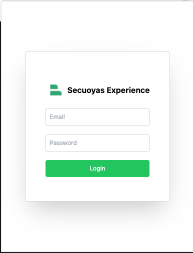

# Hub Planner Time Tracker Chrome Extension

## Descripción

Esta es una extensión de Chrome para realizar un seguimiento del tiempo en proyectos utilizando la API de Hub Planner. La
extensión permite a los usuarios iniciar y detener un temporizador para registrar el tiempo trabajado en proyectos
específicos y categorías.

### Pantalla login



### Pantalla Tracking


### Tareas recientes


## TODO

- [ ] Dividir en componentes más pequeños el RecentTasksSectionProps
- [ ] Añadir soporte para login Google Auth
- [ ] Cuando iniciamos el temporizar hay un pequeño delay hasta que se activa el contador de tiempo
- [ ] Mejorar el manejo de errores
- [ ] Optimizar el rendimiento de la ex**tensión
- [ ] Agregar pruebas unitarias
- [ ] Documentar mejor el código
- [ ] Action para autopublicar futuras releases en la chrome store
- [ ] Actualizar punto Archivos Clave del README.md
- [ ] Recibir notificación si no se han insertado horas el día anterior
    - También podría ser un recordatorio/resumen del trabajo del día anterior    

## Características

- Login de usuario con usuario y contraseña.
- Inicio y parada del temporizador.
- Registro automático del tiempo trabajado en la API de Hub Planner.
- Persistencia del estado del temporizador y los proyectos/categorías seleccionados.
- Cambio del icono de la extensión cuando el temporizador está en marcha.

## Instalación

### Prerrequisitos

- Node.js y npm instalados.
- Vite instalado globalmente (`npm install -g create-vite`).

### Clonar el repositorio

```sh
git clone git@github.com:Secuoyas-Experience/HubPlanner-Time-Tracker-Chrome-Extension.git
cd hubplanner-time-tracker-chrome
```

### Instalar dependencias

```sh
npm install
```

### Compilar la extensión

```sh
npm run build
```

### Cargar la extensión en Chrome

1. Abre Chrome y ve a `chrome://extensions/`.
2. Activa el "Modo de desarrollador" en la esquina superior derecha.
3. Haz clic en "Cargar descomprimida" y selecciona la carpeta `dist` dentro del directorio del proyecto.

## Configuración

Asegúrate de configurar las siguientes variables en el archivo `src/utils.ts`:

```env
API_URL=http://localhost:1331/api/v1
```

> URL del API intermedia que actuará como proxy, entre el plugin y la API de Hub Planner

## Uso

1. Abre la extensión haciendo clic en el icono de la extensión en la barra de herramientas de Chrome.
2. Ingresa tus credenciales de Hub Planner y haz clic en "Login".
3. Selecciona un proyecto y una categoría de las listas desplegables.
4. Haz clic en el botón de inicio para comenzar a registrar el tiempo. El icono de la extensión cambiará para indicar
   que el temporizador está en marcha.
5. Haz clic en el botón de detener para detener el temporizador y registrar el tiempo trabajado en Hub Planner.

## Estructura del Proyecto

```
/hubplanner-chrome/
|-- background
|   |-- background.ts
|-- .husky
|   |-- _
|   |   |-- husky.sh
|   |   |-- .gitignore
|   |-- pre-push
|   |-- pre-commit
|-- tsconfig.node.json
|-- index.html
|-- tailwind.config.js
|-- images
|   |-- tracking01.png
|   |-- tracking02.png
|   |-- login.png
|   |-- recentTask.png
|-- types.d.ts
|-- vite-background.config.ts
|-- README.md
|-- content_script
|   |-- content-script.ts
|   |-- main.ts
|-- public
|   |-- images
|   |-- icons
|   |-- manifest.json
|-- .prettierrc.json
|-- .gitignore
|-- package-lock.json
|-- package.json
|-- hubplanner.iml
|-- tslint.json
|-- .github
|-- vite-content.config.ts
|-- tsconfig.json
|-- .eslintignore
|-- vite.config.ts
|-- postcss.config.js
|-- .eslintrc.json
|-- share
|   |-- callHubPlannerProxy.ts
|   |-- api.ts
|-- src
|   |-- ui
|   |   |-- layout
|   |   |-- components
|   |   |-- pages
|   |-- App.tsx
|   |-- main.tsx
|   |-- content
|   |-- styles
|   |-- vite-env.d.ts
|   |-- hooks
```

## Archivos Clave

> WIP

## Desarrollo

Para ejecutar el proyecto en modo de desarrollo, utiliza el siguiente comando:

```sh
npm run dev
```

## Compilación

Para compilar el proyecto para producción, utiliza el siguiente comando:

```sh
npm run build
```

## Contribuciones

Las contribuciones son bienvenidas. Siéntete libre de abrir un issue o enviar un pull request.

## Licencia

Este proyecto está licenciado bajo la Licencia MIT. Consulta el archivo LICENSE para más detalles.
