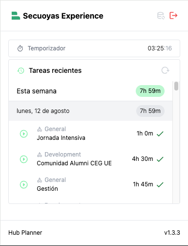

# HubPlanner Time Tracker Chrome Extension

## Descripción

Esta es una extensión de Chrome para realizar un seguimiento del tiempo en proyectos utilizando la API de HubPlanner. La
extensión permite a los usuarios iniciar y detener un temporizador para registrar el tiempo trabajado en proyectos
específicos y categorías.

### Pantalla login

### Pantalla Tracking


### Tareas recientes


## TODO

- [x] Botón para hacer reset una vez iniciado el temporizador
- [ ] Añadir loader en los botones de reset
- [ ] Tooltip para botones
- [ ] Tareas recientes
- [ ] Icono para logout
- [ ] Script para autogenerar la variable API_URL
- [ ] Mejorar el manejo de errores
- [ ] Añadir soporte para login Google Auth
- [ ] Optimizar el rendimiento de la extensión
- [ ] Agregar pruebas unitarias
- [ ] Documentar mejor el código
- [ ] Action para autopublicar futuras releases

## Características

- Login de usuario con usuario y contraseña.
- Inicio y parada del temporizador.
- Registro automático del tiempo trabajado en la API de HubPlanner.
- Persistencia del estado del temporizador y los proyectos/categorías seleccionados.
- Cambio del icono de la extensión cuando el temporizador está en marcha.

## Instalación

### Prerrequisitos

- Node.js y npm instalados.
- Vite instalado globalmente (`npm install -g create-vite`).

### Clonar el repositorio

```sh
git clone git@github.com:Secuoyas-Experience/HubPlanner-Time-Tracker-Chrome-Extension.git
cd hubplanner-time-tracker-chrome
```

### Instalar dependencias

```sh
npm install
```

### Compilar la extensión

```sh
npm run build
```

### Cargar la extensión en Chrome

1. Abre Chrome y ve a `chrome://extensions/`.
2. Activa el "Modo de desarrollador" en la esquina superior derecha.
3. Haz clic en "Cargar descomprimida" y selecciona la carpeta `dist` dentro del directorio del proyecto.

## Configuración

Asegúrate de configurar las siguientes variables en el archivo `src/utils.ts`:

```env
API_URL=http://localhost:1331/api/v1
```

> URL del API intermedia que actuará como proxy, entre el plugin y la API de Hub Planner

## Uso

1. Abre la extensión haciendo clic en el icono de la extensión en la barra de herramientas de Chrome.
2. Ingresa tus credenciales de HubPlanner y haz clic en "Login".
3. Selecciona un proyecto y una categoría de las listas desplegables.
4. Haz clic en el botón de inicio para comenzar a registrar el tiempo. El icono de la extensión cambiará para indicar
   que el temporizador está en marcha.
5. Haz clic en el botón de detener para detener el temporizador y registrar el tiempo trabajado en HubPlanner.

## Estructura del Proyecto

```
/hubplanner-time-tracker-chrome/
|-- public/
|   |-- images/
|       |-- icon-16.png
|       |-- icon-48.png
|       |-- icon-128.png
|       |-- icon_play.png
|       |-- icon_stop.png
|   |-- manifest.json
|   |-- popup.html
|   |-- tracker.html
|-- src/
|   |-- background.ts
|   |-- content.ts
|   |-- popup.ts
|   |-- tracker.ts
|   |-- utils.ts
|-- dist/
|-- package.json
|-- tsconfig.json
|-- vite.config.ts
```

## Archivos Clave

- **manifest.json**: Archivo de manifiesto de la extensión de Chrome.
- **popup.html**: HTML para la ventana emergente de la extensión.
- **tracker.html**: HTML para la página de seguimiento del tiempo.
- **background.ts**: Script de fondo de la extensión.
- **content.ts**: Script de contenido de la extensión.
- **popup.ts**: Script para la funcionalidad de la ventana emergente.
- **tracker.ts**: Script para la funcionalidad de la página de seguimiento del tiempo.
- **utils.ts**: Utilidades y funciones auxiliares.

## Desarrollo

Para ejecutar el proyecto en modo de desarrollo, utiliza el siguiente comando:

```sh
npm run dev
```

## Compilación

Para compilar el proyecto para producción, utiliza el siguiente comando:

```sh
npm run build
```

## Contribuciones

Las contribuciones son bienvenidas. Siéntete libre de abrir un issue o enviar un pull request.

## Licencia

Este proyecto está licenciado bajo la Licencia MIT. Consulta el archivo LICENSE para más detalles.
